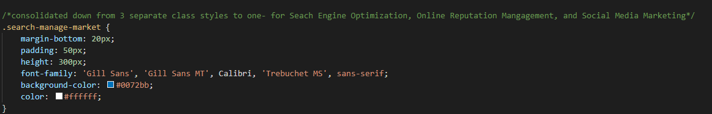
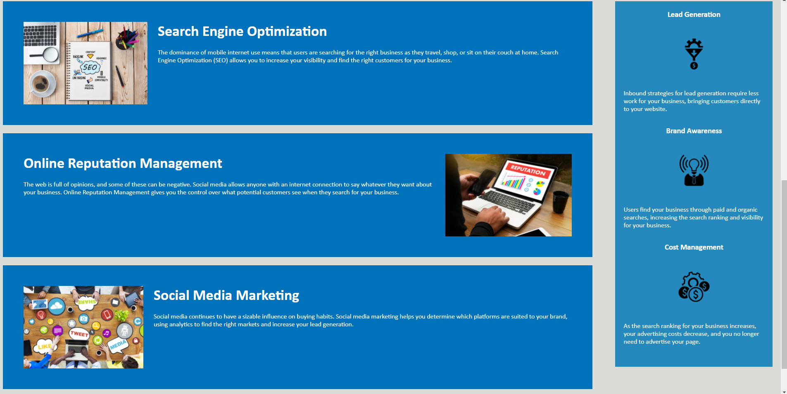

# Site-refactor

## Description
*In this project, I fixed the site to make it more accessible for the user and anyone who views the code for optimal search engines. 
The goal is to keep the site looking the same, but making it more accessible. This accounts for:

* Adding in all semantic HTML elements
* Fixing the line indentation throughout the HTML file
*  Condensing the style.css file and making it more readable/shorter
* Fixed the sequential order of headings throughout the HTML files
* Added alt attributes to all images within HTML file
* Created a more relevant title for the website
*  Commented changes throughout the document for better understanding
    ex. 

### Site Layout

The site structure needs to be kept as shown below.

### Languages Used
HTML
CSS
